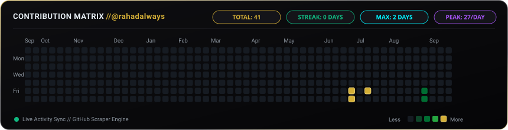

<!-- ========================================================================= -->
<!--                      THE CIPHER STACK // RAHAD HASAN                      -->
<!-- ========================================================================= -->

<!-- 1. TOP SECTION: TERMINAL PORTRAIT & INFO CARD -->
<h3><code>The Cipher Stack</code></h3>

<table border="0" style="border-collapse: collapse; border: none;">
  <tr style="border: none;">
    <td align="center" valign="middle" style="border: none; padding: 6px;">
      
    </td>
    <td align="center" valign="middle" style="border: none; padding: 6px;">
      
    </td>
  </tr>
</table>

 

<!-- 2. MIDDLE SECTION: CINEMATIC HEADER -->

 

  
  &nbsp;
  
  &nbsp;
  

<!-- Typing SVG Quotes Banner -->

  

 

<!-- 3. THIRD SECTION: LIVE CONTRIBUTION HEATMAP -->
<h3><code>Contributions</code></h3>

  

 

---

### ?? Featured Deployments & Projects

<table width="100%">
  <tr>
    <td width="50%" valign="top">
      <h4 align="left">?? <a href="https://rahadhasan.com"><b>RahadHasan.com // Digital HQ</b></a></h4>
      
High-performance personal portfolio, developer terminal, and interactive engineering lab built with modern web technologies, 3D Canvas visualizers, and seamless responsiveness.

      

        
        
        
        
      

      
?? <a href="https://rahadhasan.com"><b>Live Preview ?</b></a>

    </td>
    <td width="50%" valign="top">
      <h4 align="left">? <a href="https://github.com/rahadalways"><b>Neural Motion & Video Engine</b></a></h4>
      
Autonomous capability-first video production and motion rendering pipeline. Converts raw media into high-impact code-based motion graphics with Playwright, Remotion, and FFmpeg.

      

        
        
        
        
      

      
?? <a href="https://github.com/rahadalways"><b>Repository ?</b></a>

    </td>
  </tr>
  <tr>
    <td width="50%" valign="top">
      <h4 align="left">??? <a href="https://github.com/rahadalways"><b>Cipher Stack Cloud Hub</b></a></h4>
      
Scalable distributed microservices backend with realtime database synchronization, robust role-based access control, high-concurrency API gateways, and automated CI/CD pipelines.

      

        
        
        
        
      

      
?? <a href="https://github.com/rahadalways"><b>Repository ?</b></a>

    </td>
    <td width="50%" valign="top">
      <h4 align="left">?? <a href="https://github.com/rahadalways"><b>Cross-Platform Mobile Ecosystem</b></a></h4>
      
Ultra-responsive mobile suite delivering native iOS and Android experiences with shared TypeScript logic, offline-first data caching, push notifications, and high-FPS animations.

      

        
        
        
        
      

      
?? <a href="https://github.com/rahadalways"><b>Repository ?</b></a>

    </td>
  </tr>
</table>

 

---

### ??? Tech Arsenal & Weaponry

<h4>Frontend &amp; Creative 3D</h4>

  

<h4>Backend, Cloud &amp; Databases</h4>

  

<h4>Mobile &amp; App Development</h4>

  

<h4>DevOps, Automation &amp; Tools</h4>

 

---

### ? What I'm Up To

| Category | Focus & Details |
| :--- | :--- |
| ?? **Currently Building** | Production-grade AI agent systems, autonomous video workflows, and interactive 3D web applications |
| ?? **Currently Learning** | Deep learning agents, WebGPU shaders, and distributed systems architecture |
| ?? **Ask Me About** | React, TypeScript, Python backend engineering, API architecture, and creative SVG graphics |
| ? **Fun Fact** | I believe code should not only function with 99.99% reliability, but also look aesthetically cinematic |

 

---

### ?? GitHub Achievements

  
  &nbsp;&nbsp;
  
  &nbsp;&nbsp;
  
  &nbsp;&nbsp;
  

 

---

<!-- 8. SOCIALS & CONNECT -->

<h3><code>Socials &amp; Connect</code></h3>

  
  &nbsp;
  
  &nbsp;
  
  &nbsp;
  
    
  
  &nbsp;
  

 

<!-- Dynamic QR Code pointing to live portfolio -->

  
   
  ? <b>Scan or click to launch Portfolio: rahadhasan.com</b>

 

<!-- Footer Wave Banner -->

  Designed &amp; Engineered with ?? and Pure SVG by <b>Rahad Hasan</b> ? &copy; 2026 All Rights Reserved

